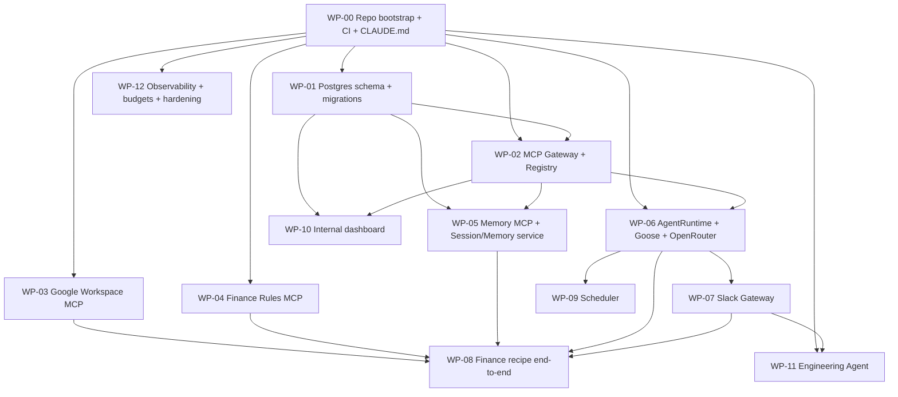

# BUILD-PLAYBOOK.md - Delegating the ScottyLabs Agent Platform to Claude Code

This playbook breaks the system in `ScottyLabs-Agent-Platform-Design.md` into **work packages
(WPs)** you can hand to Claude Code agents one at a time or in parallel. Each WP is a
self-contained brief: objective, what to read, deliverables, the interface contract it must honor,
acceptance criteria, guardrails, and a copy-paste kickoff prompt.

Treat each WP as one Claude Code session (or one subagent in an agent team). Build in dependency
order; run independent WPs in parallel.

## How to use this playbook

1. **Start every session by having the agent read `CLAUDE.md`** (conventions and guardrails) and
   the design-doc sections listed in the WP. This is the context that keeps agents consistent.
2. **One WP per branch and PR.** Keep diffs reviewable. CI must be green before merge.
3. **Honor the interface contracts.** WPs are decoupled by the contracts in each brief (the
   `AgentRuntime` interface, the MCP `manifest.yaml`, the Postgres schema, the gateway's
   register and call API). As long as an agent honors its contract, parallel work composes.
4. **Delegating to subagents / agent teams.** For a wave of independent WPs, spawn one subagent
   per WP with that WP's kickoff prompt. Give each only the files it owns plus the shared
   contracts. Have a lead session integrate at the end of the wave.
5. **Definition of done** is in `CLAUDE.md` and repeated per WP. No WP is done without tests.

## Dependency graph

## Parallelization (waves)

- **Wave 0 (serial):** WP-00.
- **Wave 1 (parallel):** WP-01, then WP-02 once WP-01 lands. WP-03, WP-04, and WP-11 can start in
  parallel right after WP-00 (they only need the template and the manifest contract).
- **Wave 2 (parallel):** WP-05, WP-06, WP-10 once WP-02 exists.
- **Wave 3 (serial-ish):** WP-07 after WP-06; WP-09 after WP-06.
- **Wave 4 (integration):** WP-08 ties finance together. WP-12 runs continuously alongside.

A small team can run 3 to 4 agents per wave. The reference target (a working finance workflow in
Slack) is WP-00, 01, 02, 03, 04, 05, 06, 07, 08.

## Shared contracts (read once, honored by all WPs)

- **MCP server contract:** layered structure and `manifest.yaml` from `mcp-servers/_template/`
  (the `scottylabs-mcp-template-go`). Tools declare `scope` and `impact`. Streamable HTTP at `/mcp`,
  health at `/healthz`. Stateless and idempotent.
- **AgentRuntime interface (WP-06):** `submit_task(recipe_id | inline_goal, params, identity,
  committee) -> stream of events`, `request_approval(...) -> approval_id`, `result(...) ->
  {output, audit_ref}`. Callers (Slack Gateway, Scheduler) depend only on this.
- **Gateway API (WP-02):** `register(manifest)`, `list_tools(identity)`, `call(tool, args,
  identity) -> result` with auth, per-tool scope enforcement, HITL gating on `impact: high`, and
  audit. Clients are the runtime and members' Claude.
- **Postgres schema (WP-01):** the tables in design-doc Section 4.4. All persistence goes through
  it.

---

## WP-00 - Repo bootstrap, conventions, and CI

**Depends on:** nothing. **Read:** design Sections 2, 4, 7; `CLAUDE.md`.

**Objective:** Create the monorepo skeleton, shared tooling, CI, and the contributor docs so every
later WP has a consistent home.

**Deliverables:**
- The directory tree from design Section 7.2 (`runtime/`, `services/`, `gateway/`, `recipes/`,
  `mcp-servers/` with `_template/` copied from `scottylabs-mcp-template-go`, `skills/`, `docs/`,
  `infra/`, `.github/`).
- Root `CLAUDE.md` (provided), `docs/CONTRIBUTING.md`, `docs/SECURITY.md`,
  `docs/recipe-spec.md`, `docs/mcp-server-checklist.md`, `docs/mcp-hosting-on-railway.md`.
- `.github/CODEOWNERS` (per-committee ownership) and CI workflows: format (`gofmt`), vet
  (`go vet`), lint (`golangci-lint`), tests (`go test ./...`), recipe schema validation, manifest
  validation.
- Shared dev config (formatting, pre-commit) and a `Makefile` or task runner for `test`, `lint`,
  `deploy`.

**Acceptance:** `make test` and `make lint` run green on an empty repo; CI passes on a trivial PR;
the `_template` server's tests pass in CI.

**Guardrails:** no secrets; CI blocks merges on red.

**Kickoff prompt:**
> Read `CLAUDE.md` and Sections 2, 4, and 7 of `ScottyLabs-Agent-Platform-Design.md`. Bootstrap the
> `scottylabs-agent` monorepo exactly as in Section 7.2. Copy `scottylabs-mcp-template-go` into
> `mcp-servers/_template/`. Add CI (gofmt, go vet, golangci-lint, go test, recipe-schema check, manifest validation),
> CODEOWNERS, the docs stubs, and a Makefile with `test`, `lint`, `deploy`. Open a PR. Definition of
> done is in `CLAUDE.md`.

---

## WP-01 - Postgres schema and migrations

**Depends on:** WP-00. **Read:** design Section 4.4 (schema), Section 10 (audit, retention).

**Objective:** Implement the durable state model: identity and roles, sessions, turns, summaries,
memory facts, approvals, and the audit log, with migrations.

**Deliverables:**
- Migrations creating: `users`, `committee_roles`, `sessions`, `turns`, `summaries`,
  `memory_facts` (with `scope_type`, `scope_id`, `tags`, `expires_at`), `approvals`, `audit_log`.
- A small typed data-access module (repository pattern) with functions the gateway, runtime, and
  memory service will use. No business logic.
- A retention job stub (delete expired `memory_facts`, age out old audit rows per policy).

**Acceptance:** migrations apply and roll back cleanly on a fresh Railway Postgres; repository unit
tests pass against a test database; scoped reads never cross `scope_id`.

**Interface contract:** the repository functions are the only way other WPs touch the database.

**Kickoff prompt:**
> Read Section 4.4 and Section 10 of the design doc. Implement the Postgres schema and migrations
> and a typed repository module (no business logic). Include a retention job stub. Add tests
> against a disposable Postgres. Open a PR per `CLAUDE.md`.

---

## WP-02 - MCP Gateway and Registry

**Depends on:** WP-00, WP-01. **Read:** design Section 6, Section 10; the MCP server contract.

**Objective:** Stand up the capability bus: adopt an open-source MCP gateway, add the ScottyLabs
policy layer (committee roles, per-tool scope enforcement, HITL gating on `impact: high`), and a
registry driven by each server's `manifest.yaml`, with full audit.

**Deliverables:**
- Deployed gateway (adopted OSS, for example ContextForge or the agentic-community gateway) with
  config in `gateway/`.
- Registry: load servers from manifests; store metadata in Postgres (WP-01); lifecycle
  `proposed -> approved`; enable/disable.
- Auth: OAuth 2.1 + PKCE for humans, signed service creds for the agent. Resolve caller to
  identity + committee roles.
- Enforcement: a caller sees only tools their role permits; `impact: high` requires an approval
  record before execution; every call audited (redacted args).

**Acceptance:** a registered read tool is callable by an authorized identity and denied to an
unauthorized one; a high-impact tool blocks until an approval row exists; all calls appear in
`audit_log`.

**Interface contract:** `register`, `list_tools(identity)`, `call(tool, args, identity)`.

**Kickoff prompt:**
> Read Section 6 and Section 10. Adopt an OSS MCP gateway, deploy it in `gateway/`, and add the
> ScottyLabs policy layer: committee-role resolution, per-tool scope enforcement, HITL gating on
> `impact: high`, and audit to Postgres (use WP-01's repository). Implement the registry from
> `manifest.yaml`. Provide the `register` / `list_tools` / `call` API. Tests for allow, deny, and
> gated paths. PR per `CLAUDE.md`.

---

## WP-03 - Google Workspace MCP

**Depends on:** WP-00 (template), composes with WP-02. **Read:** design Sections 7.6, 8; the
template README.

**Objective:** A capability server exposing Calendar, Gmail, Drive, and Sheets tools, read-first,
acting as the agent's scottylabs.org identity via a scoped service account.

**Deliverables:**
- Tools: `sheets.read`, `calendar.list`, `calendar.create_event` (impact: write),
  `gmail.draft` (write), `gmail.send` (impact: high), `drive.read`. Each in the layered structure;
  Google access wrapped in a client behind an interface.
- `manifest.yaml` with scopes and impact; domain-wide-delegation config documented (scopes only).
- Tests with a fake Google client (no live calls in CI).

**Acceptance:** read tools work against a test fixture; `gmail.send` is `impact: high`; no
credentials in code; manifest validates.

**Kickoff prompt:**
> Using `mcp-servers/_template/` and Sections 7.6 and 8, build the Google Workspace MCP. Wrap the
> Google APIs in a client behind a Protocol; keep handlers thin; logic and mapping tested with a
> fake client. Mark `gmail.send` and `calendar.create_event` correctly in `manifest.yaml`. PR per
> `CLAUDE.md`.

---

## WP-04 - Finance Rules MCP

**Depends on:** WP-00 (template). **Read:** design Section 9; `recipes/finance/standards/`.

**Objective:** The deterministic "rules as code" server for reimbursement screening (this is the
template's example, hardened for production).

**Deliverables:**
- `evaluate_reimbursement` (impact: read) returning pass / fail (with failed standards) / review,
  as pure functions in `domain/`.
- Standards loaded from a reviewed file, not hardcoded.
- Thorough unit tests for each rule and the edge-case (review) band.

**Acceptance:** the test matrix in design Section 9 passes; verdicts are deterministic and
explainable; manifest validates.

**Kickoff prompt:**
> Read Section 9. Promote `mcp-servers/_template/` into `mcp-servers/finance-rules/`: implement the
> reimbursement rules as pure functions, load standards from a reviewed file, and cover every rule
> plus the review band with tests. PR per `CLAUDE.md`.

---

## WP-05 - Memory MCP and Session/Memory service (statefulness + context engineering)

**Depends on:** WP-01, WP-02. **Read:** design Section 4.4.

**Objective:** Per-user, per-committee statefulness and the context-assembly pipeline.

**Deliverables:**
- A Memory MCP exposing `memory.write_fact`, `memory.search` (scoped, top-k by tag + recency),
  `memory.forget`, backed by Postgres (WP-01).
- A Session/Memory service that, per turn, assembles budgeted context in priority order (system +
  `.goosehints` + recipe + retrieved memory + rolling summary + recent turns + trimmed tool
  output) and updates the summary and facts after each turn.
- Scoping tests proving one user's facts never surface for another.

**Acceptance:** retrieval is scoped and budgeted; summaries update; a "forget" removes a fact;
context stays under the configured token budget.

**Kickoff prompt:**
> Read Section 4.4. Build the Memory MCP (scoped write/search/forget over WP-01's tables) and the
> Session/Memory service implementing the context-assembly pipeline with a token budget and rolling
> summaries. Prove scoping with tests. PR per `CLAUDE.md`.

---

## WP-06 - AgentRuntime interface + Goose + OpenRouter

**Depends on:** WP-00, WP-02. **Read:** design Sections 4.2, 5, 5.5.

**Objective:** Wrap Goose behind the thin `AgentRuntime` interface, configured to use OpenRouter,
loading recipes, calling tools through the gateway, and supporting human approval.

**Deliverables:**
- `runtime/` with the `AgentRuntime` interface and a Goose-backed implementation: headless Goose
  configured via env (`GOOSE_PROVIDER=openrouter`, `GOOSE_MODEL`, `OPENROUTER_API_KEY`), the
  gateway registered as an MCP extension, recipe loading from `recipes/`, and a default
  `.goosehints` with org guidance.
- Per-recipe model override; escalate-to-Opus hook for hard tasks.
- Approval flow: when a tool is `impact: high`, surface an approval request and resume on grant.

**Acceptance:** `submit_task` runs a trivial recipe end-to-end against a stub tool; a high-impact
tool triggers `request_approval` and only proceeds after a grant; switching `GOOSE_MODEL` changes
the model with no code change.

**Interface contract:** the `AgentRuntime` interface above. Slack Gateway and Scheduler use only it.

**Kickoff prompt:**
> Read Sections 4.2, 5, and 5.5. Define the `AgentRuntime` interface and implement it with headless
> Goose configured for OpenRouter. Register the gateway as an MCP extension, load recipes, support
> per-recipe model choice, and implement the approval pause/resume for `impact: high`. Tests with a
> stub tool and a fake gateway. PR per `CLAUDE.md`.

---

## WP-07 - Slack Gateway

**Depends on:** WP-06. **Read:** design Sections 3.3, 9.4; Appendix E (Slack scopes).

**Objective:** The human front door: a Bolt app that takes intake, acknowledges fast, runs work in
the background via `AgentRuntime`, and renders approval blocks.

**Deliverables:**
- Bolt app (HTTP Events API in prod, Socket Mode for local) handling `app_mention`, DMs, and the
  assistant panel; scopes per Appendix E.
- Fast `ack()` then background job; post results and an approval block (Approve / Review / Cancel)
  to the originating thread; record approvals via the gateway.
- A `/fix-bug` slash command stub that enqueues to the Engineering Agent (WP-11).

**Acceptance:** an `@mention` returns an ack within Slack's timeout, runs a stub task, and posts a
result; clicking Approve records the approval and resumes the gated action.

**Kickoff prompt:**
> Read Sections 3.3 and 9.4 and Appendix E. Build the Slack Gateway (Bolt): intake, fast ack,
> background processing through the `AgentRuntime` interface (WP-06), and approval blocks wired to
> the gateway's approval records. Add a `/fix-bug` command that enqueues to the Engineering Agent.
> Tests with a fake runtime. PR per `CLAUDE.md`.

---

## WP-08 - Finance reference workflow, end to end

**Depends on:** WP-03, WP-04, WP-05, WP-06, WP-07. **Read:** design Section 9 in full.

**Objective:** Ship the reference: `screen-reimbursement` from Slack to drafted returns to human
approval to send, fully audited, with the appeal path.

**Deliverables:**
- `recipes/finance/screen-reimbursement.yaml` (and the `draft-and-confirm` subrecipe in
  `recipes/shared/`) per design Section 7.3.
- Wiring so the recipe reads the sheet (WP-03), evaluates each row (WP-04), drafts returns
  (WP-03, no send), routes edge cases with a recommendation, posts a Slack summary + approval, and
  sends only after approval.
- The appeal line in returned emails routes to a human, not the agent.

**Acceptance:** a seeded sheet produces correct pass/fail/review splits; nothing sends before
approval; edge cases are never auto-decided; every step is in `audit_log`; the appeal path works.

**Kickoff prompt:**
> Read Section 9 fully. Author `screen-reimbursement.yaml` and the `draft-and-confirm` subrecipe,
> and wire the end-to-end finance flow across the Google, Finance Rules, Memory, runtime, and Slack
> components already built. Verify the pass/fail/review splits, the no-send-before-approval rule,
> and the audit trail with an integration test on seeded data. PR per `CLAUDE.md`.

---

## WP-09 - Scheduler

**Depends on:** WP-06. **Read:** design Sections 4.2, 11.1 (cron), 11.4 (digest).

**Objective:** Recurring runs (for example daily reimbursement screening and a weekly leadership
digest) via Railway cron, invoking recipes through `AgentRuntime`.

**Deliverables:** a scheduler service using Railway cron (min 5-minute granularity, UTC); a
weekly digest recipe (volume, approvals, returns, spend); config for schedules.

**Acceptance:** a scheduled job triggers a recipe on cadence and posts to Slack; failures are
logged and surfaced.

**Kickoff prompt:**
> Read Sections 4.2 and 11. Build the Scheduler on Railway cron to invoke recipes via
> `AgentRuntime`, including a weekly leadership digest recipe. Tests with a fake clock and runtime.
> PR per `CLAUDE.md`.

---

## WP-10 - Internal dashboard

**Depends on:** WP-01, WP-02. **Read:** design Sections 6.3, 10.2, 11.4.

**Objective:** A small internal web view for the registry, recent runs, pending approvals, and
spend.

**Deliverables:** read views over Postgres (registry, audit, approvals, budgets); approve/deny
controls that write approval records; server-health from the registry. Auth-gated to maintainers.

**Acceptance:** maintainers can see and act on pending approvals and view the audit log and
registry; non-maintainers cannot.

**Kickoff prompt:**
> Read Sections 6.3, 10.2, 11.4. Build a maintainer-only internal dashboard over WP-01 and WP-02:
> registry, audit log, pending approvals (with approve/deny), and spend. Tests for the auth gate
> and the approval write path. PR per `CLAUDE.md`.

---

## WP-11 - Engineering Agent (PRs + Railway Sandbox)

**Depends on:** WP-00, WP-07. **Read:** design Section 12; Appendix H. **Isolated trust domain:
no access to the gateway, Google, finance data, or production secrets.**

**Objective:** From `/fix-bug repo#issue`, run a headless coding agent in a throwaway Railway
Sandbox, then open a draft PR on the Labrador org for human review.

**Deliverables:**
- A GitHub App (least privilege: Contents read/write, Pull requests write; opt-in repos) and code
  to mint short-lived per-repo installation tokens.
- An orchestrator that creates a Railway Sandbox (template + fork for fast start), clones the repo,
  runs a headless coding agent (Goose or Claude Code) to reproduce, fix, and test, pushes a branch,
  opens a draft PR, posts the PR link + test summary to Slack, and destroys the sandbox.
- Egress allowlist (package registries + GitHub API only; block metadata and RFC1918), per-task
  time and cost ceilings, and a maintainer allowlist for who can trigger tasks and on which repos.

**Acceptance:** a scoped bug yields a draft PR with passing tests, produced in an isolated sandbox
that is destroyed afterward; the app cannot merge (branch protection); no production credentials are
present in the sandbox.

**Kickoff prompt:**
> Read Section 12 and Appendix H. Build the Engineering Agent as an isolated subsystem: a
> least-privilege GitHub App, an orchestrator that uses Railway Sandboxes (template + fork) to run a
> headless coding agent that fixes a scoped issue, runs tests, pushes a branch, and opens a draft
> PR, posting results to Slack. Enforce the egress allowlist, time/cost ceilings, and a maintainer
> allowlist. It must not touch the gateway or any production secret. Tests with a fake sandbox and a
> fake GitHub client. PR per `CLAUDE.md`.

---

## WP-12 - Observability, budgets, and security hardening (continuous)

**Depends on:** runs alongside everything. **Read:** design Section 10, 11.4.

**Objective:** Make the platform safe and affordable in production.

**Deliverables:** structured logging to Railway + audit tables; per-committee and global rate
limits at the gateway; per-task token budgets and an OpenRouter spend alarm; secret-rotation
runbook in `docs/SECURITY.md`; a checklist verifying the egress allowlist, HITL gating, and
fail-closed defaults.

**Acceptance:** a load spike hits rate limits gracefully; exceeding a budget alerts and throttles;
the security checklist passes.

**Kickoff prompt:**
> Read Sections 10 and 11.4. Add rate limits, token budgets, an OpenRouter spend alarm, structured
> logging, and a secret-rotation runbook. Produce and pass a security checklist (egress allowlist,
> HITL gating, fail-closed). PR per `CLAUDE.md`.

---

## Mapping to the roadmap

- **Phase 0 (foundations):** WP-00, WP-01, WP-02, WP-03 (read-only).
- **Phase 1 (finance reference):** WP-04, WP-05, WP-06, WP-07, WP-08.
- **Phase 2 (contribution + 2nd committee):** harden WP-02 RBAC, publish docs, add an events server
  and recipe by copying the WP-03/WP-04/WP-08 pattern.
- **Phase 3 (scale):** WP-09, WP-10, WP-12, more committees.
- **Phase 4 (Engineering Agent, parallel):** WP-11.

## Tips for driving Claude Code agents well

- Give each agent its WP brief plus `CLAUDE.md`, and tell it to read the cited design sections
  before coding. Resist pasting the whole design doc; the cited sections are enough and keep
  context focused.
- Ask for a short plan first, then implementation, then tests, then a PR description. Require green
  CI before it calls the WP done.
- Keep agents inside their WP's files and contract. When two WPs must meet, have a lead session do
  the integration (WP-08 is the canonical integration WP).
- Prefer many small PRs over one large one. Each WP should be reviewable in a sitting.
- When an agent proposes putting logic in the core, push it to the edge instead: a recipe or an MCP
  server. The core stays thin on purpose.

