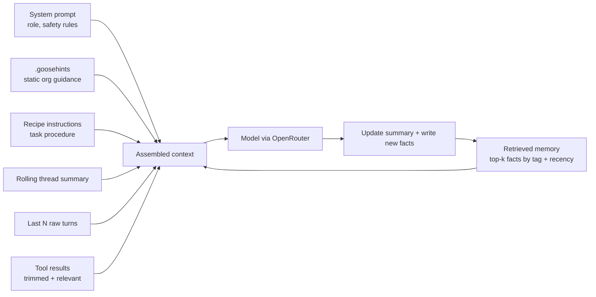
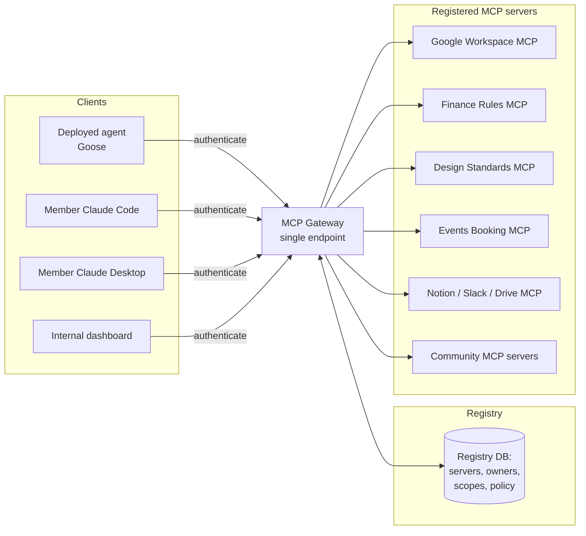
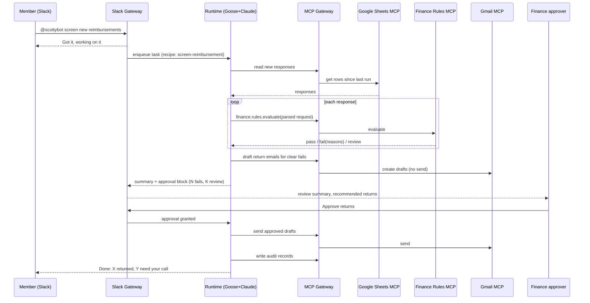
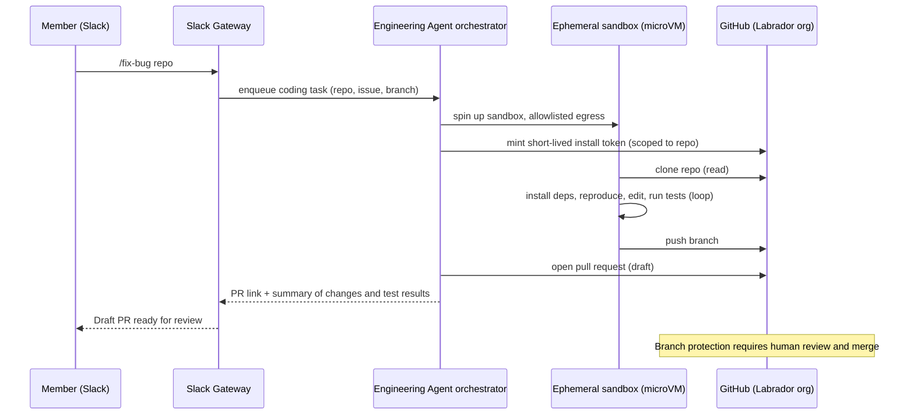

# ScottyLabs Agent Platform: Design Document

**Status:** Draft v0.2 (for review)
**Owner:** Thomas Kanz (tkanz@cmu.edu) and the ScottyLabs technical team
**Audience:** ScottyLabs leadership (Sections 1-3, 12, 13) and the build team (all sections)
**Last updated:** June 5, 2026
**Companion files:** `BUILD-PLAYBOOK.md` (step-by-step Claude Code build instructions) and the `scottylabs-mcp-template-go` starter repo

---

## Table of Contents

1. Executive Summary
2. Goals, Non-Goals, and Design Principles
3. Users and Use Cases
4. System Architecture
    - 4.4 Statefulness, Memory, and Context Engineering
5. Runtime and Model Layer: Goose plus OpenRouter
    - 5.5 Model Access via OpenRouter and the OpenAI-Compatible API
6. The MCP Gateway and Registry (Capability Bus)
7. Contribution and Extensibility Model
    - 7.6 Hosting MCP Servers on Railway: The Method
    - 7.7 Software Engineering Standards for MCP Servers
    - 7.8 Language Choice and Performance
    - 7.9 The Extensibility Model
8. Identity, Accounts, and Access
9. Reference Workflow: Finance Automated Form Rejection
10. Security, Safety, and Guardrails
11. Deployment and Operations on Railway
12. Engineering Agent: Autonomous Code Fixes and Pull Requests
13. Phased Roadmap
14. Risks and Open Questions
15. Appendices

---

## 1. Executive Summary

ScottyLabs runs on volunteer time. Committees repeat the same structured work every week: booking events, screening reimbursement forms, reviewing designs, answering policy questions, and chasing approvals. This document proposes a shared **ScottyLabs Agent Platform**: one always-available AI teammate that leadership and committees reach through Slack, that operates real systems through its own scottylabs.org Google account, and that any technically minded member can extend by contributing two things: **workflows** (how to do a task) and **capabilities** (what systems it can touch).

The platform is built on three ideas that keep it powerful and safe at the same time.

First, a **managed agent runtime** does the reasoning and tool use. The decision is **Goose**, the open-source agent now stewarded by the Agentic AI Foundation. Goose is self-hostable, free of per-seat cost, has a native workflow format (recipes), and speaks the Model Context Protocol natively. For the model, Goose connects to **any OpenAI-compatible provider**, so we route through **OpenRouter**: one API key and one bill that reach Claude, GPT, Llama, and others, with the freedom to change models per task without code changes. The default is a Claude Sonnet class model for everyday work and a Claude Opus class model for hard reasoning. The architecture keeps the runtime behind a thin internal boundary so we can swap to the Claude Agent SDK later if we outgrow recipes, without rewriting everything around it.

Second, a **shared MCP Gateway and Registry** acts as the platform's capability bus. Instead of every member wiring tools into their own client, the gateway exposes one governed endpoint that fronts many MCP servers (Google Calendar, Gmail, Drive, a finance rules server, a design-asset server, and so on). The deployed agent connects to it, and individual members can point their own Claude Code or Claude Desktop at the same gateway. The gateway is where authentication, least-privilege scoping, per-committee access policy, and audit logging live.

Third, a **contribution and extensibility model** lets members extend the platform through pull requests. A workflow is a recipe (a YAML file describing instructions, the tools it needs, and its parameters). A capability is an MCP server (a small service that exposes admin actions for a specific system). Both go through review, CI, and a per-committee ownership model before they go live, and there is a clear, documented method for hosting a new MCP server on Railway (Section 7.6).

Two further capabilities round out the platform. It stays **stateful for each user** and does deliberate **context engineering**: it remembers a person's prior decisions, preferences, and ongoing tasks across sessions, and assembles each request's context from static org guidance, the task recipe, retrieved memory, and a rolling summary rather than dumping everything into the model (Section 4.4). And an **Engineering Agent** can fix bugs and open pull requests on the ScottyLabs (Labrador) GitHub organization from a sandboxed, internet-enabled environment, so leadership can hand it a broken project and get a reviewable PR back, with a human always merging (Section 12).

The first workflow we build end to end is **finance automated form rejection**: the agent screens incoming reimbursement and funding requests against published standards, auto-returns the ones that clearly fail with a specific, friendly explanation, and routes the genuine edge cases to a human with a recommendation. This is the canonical reference because it exercises every layer: Slack intake, Google Forms and Sheets and Gmail, a rules-as-code MCP server, human-in-the-loop approval, and a full audit trail.

**Headline decisions at a glance:**

| Decision | Choice | Why |
|---|---|---|
| Agent runtime | Goose (decided) | Self-hostable, free runtime, native recipes and MCP, mental model transfers from Claude Code |
| Model access | OpenRouter via the OpenAI-compatible API | One key and one bill across providers; swap models per task; default Claude Sonnet, escalate to Opus |
| Capability sharing | Shared MCP Gateway and Registry | One governed endpoint for the agent and members' own Claude clients; centralizes auth, scoping, audit |
| Extending the agent | Recipes (workflows) and MCP servers (capabilities) via PRs | Parameterized and reviewable; capabilities are independently deployable services |
| Hosting MCP servers | Railway, hybrid model | Official servers in the org monorepo and project; community servers from a template repo, registered at the gateway |
| Statefulness | Per-user memory plus context engineering | Continuity across sessions via a Memory MCP backed by Postgres; deliberate context assembly |
| Engineering Agent | Sandboxed coding agent that opens PRs | Ephemeral microVM with allowlisted internet; GitHub App with least privilege; humans merge |
| Platform hosting | Railway | Managed Postgres, private networking, volumes, cron, pay-per-second; cheap for a student org |
| The agent's identity | Dedicated scottylabs.org account, scoped per service via OAuth | Clear identity in audit logs, least privilege, easy revocation |
| Money and irreversible actions | Always human-confirmed; never auto-executed | Safety guardrail that cannot be overridden by a prompt |

**Indicative cost:** roughly $20-40/month for Railway (Pro plan plus modest usage), plus model usage billed through OpenRouter that scales with volume, plus a few dollars of ephemeral sandbox time for the Engineering Agent (Railway Sandboxes, billed as Railway usage; E2B is an alternative at about $0.10 per sandbox-hour). A realistic early-stage budget is on the order of $50-200/month total. See Appendix F.

---

## 2. Goals, Non-Goals, and Design Principles

### 2.1 Goals

The platform should give every committee a reliable assistant that does real work, not just chat. It should be reachable where people already are (Slack first). It should act through real ScottyLabs systems under its own identity, so its actions are attributable and revocable. It should be extensible by members without forking or redeploying the core: contributing a new workflow or a new capability should be a pull request, not a platform rewrite. It should be safe by construction, with money movement and other irreversible actions always gated behind a human. And it should be cheap enough for a student organization to run continuously.

### 2.2 Non-Goals

This is not a general-purpose chatbot for the whole student body; it serves ScottyLabs leadership and committees. It is not a replacement for human judgment on ambiguous decisions; it screens, drafts, routes, and recommends, and humans decide the close calls. It will not execute financial transactions, send money, or take other irreversible external actions autonomously. It is not, in v1, a custom-trained or fine-tuned model effort; we use hosted Claude models through an API. And it is not a multi-organization SaaS product; it is internal infrastructure for one org, though the contribution model is designed so the pattern could be reused.

### 2.3 Design Principles

**Workflows are data, not code branches.** A new committee process should be a recipe file, reviewed and merged, not a change to the agent's core logic.

**Capabilities are services, not hardcoded integrations.** A new system the agent can touch should be an MCP server behind the gateway, with its own scopes and owner.

**Least privilege everywhere.** Every tool, every scope, every committee gets exactly the access it needs and no more. The default answer to "should this be allowed" is no until justified.

**Humans own irreversible decisions.** The agent proposes; a human disposes for anything involving money, external communication at scale, deletion, or policy exceptions.

**Everything is auditable.** Every action the agent takes through the gateway is logged with who asked, what ran, what it touched, and what it returned.

**Runtime is swappable.** We commit to a runtime, but we hide it behind an internal interface so the platform is not hostage to one project's roadmap.

**Optimize for contributor velocity.** The team is strong with Claude Code. The platform should let them build, test, and ship a workflow in an afternoon.

---

## 3. Users and Use Cases

### 3.1 Personas

**Leadership** wants status, summaries, approvals, and the confidence that the agent is acting within policy. They interact mostly through Slack and care about reliability and oversight.

**Committee members** want their recurring work done or pre-processed: an event booked, a form screened, a design checked, a policy answered. They interact through Slack channels and direct messages.

**Contributors (the technical team)** want to add and maintain workflows and capabilities. They interact through the repository, their own Claude Code or Claude Desktop, the MCP gateway, and a local Goose instance for testing.

**The agent itself** is a first-class actor with its own identity (a scottylabs.org account), its own scoped credentials, and its own audit trail.

### 3.2 Committee needs

ScottyLabs committees have distinct, partly overlapping needs. Three anchor the design:

**Finance** needs to screen reimbursement and funding requests against published standards, auto-return clear failures with a specific reason, and route real edge cases to a human. This is the v1 reference workflow (Section 9).

**Events** needs to take an event request, check calendar and room availability, draft the booking, file the required forms, and put a confirmation in front of an organizer for approval.

**Design** needs to take a submitted asset (a poster, a slide, a web mock), check it against brand and accessibility standards, and return structured, actionable feedback before a human reviewer signs off.

Other committees (corporate, operations, specific event teams like TartanHacks and cm?HACKS) plug in through the same two contribution types once the platform exists.

### 3.3 Interaction surfaces

**Slack is the primary surface.** Members @mention the agent in a committee channel or open a thread in the assistant side panel. The agent acknowledges immediately, works in the background, and replies in-thread with results, drafts, or an approval request with buttons.

**Members' own Claude clients are a secondary surface.** Because capabilities live behind the shared MCP gateway, a contributor can point Claude Code or Claude Desktop at the same gateway and use the exact tools the deployed agent uses, for development, debugging, or ad hoc admin work.

**A thin web and CLI surface** exists mainly for the build team: Goose's own web and CLI modes for testing recipes, plus a small internal dashboard for the registry and audit log.

---

## 4. System Architecture

### 4.1 Overview

The platform is organized as a small number of layers with clear responsibilities. Requests enter through an interface, get routed to the agent runtime, which reasons and calls tools through the capability bus, under an identity and access layer, recording everything to the state and governance layers.

```mermaid
flowchart TB
    subgraph Interfaces
        SL[Slack: channels, DMs, assistant panel]
        MC[Members' Claude Code / Desktop]
        WB[Internal web + CLI dashboard]
    end

    subgraph Edge["Edge / Orchestration"]
        SG[Slack Gateway service<br/>Bolt app, ack + background jobs]
        RT[Agent Runtime: Goose headless]
        MEM[Session + Memory service<br/>context engineering]
        SCH[Scheduler / cron triggers]
    end

    OR[OpenRouter<br/>OpenAI-compatible model API]

    subgraph Capability["Capability Bus"]
        GW[MCP Gateway + Registry<br/>auth, scoping, audit, discovery]
        M1[Google MCP: Calendar/Gmail/Drive/Sheets]
        M2[Finance Rules MCP]
        M3[Design Standards MCP]
        M4[Events Booking MCP]
        M6[Memory MCP<br/>Postgres-backed]
        M5[Community-contributed MCP servers]
    end

    subgraph Knowledge["Workflow Library"]
        RC[Recipes / Skills repo<br/>per-committee workflows]
    end

    subgraph State["State, Identity, Governance"]
        PG[(Postgres: memory, audit,<br/>approvals, registry metadata)]
        ID[Identity: scottylabs.org account<br/>OAuth, secrets manager]
        HITL[Human-in-the-loop approvals]
    end

    subgraph Eng["Engineering Agent (isolated trust domain)"]
        EA[Coding agent orchestrator]
        SBX[Railway Sandbox (throwaway)<br/>allowlisted internet]
        GH[(GitHub: ScottyLabs Labrador org)]
    end

    SL --> SG --> RT
    MC --> GW
    WB --> GW
    SCH --> RT
    RT --> OR
    RT --> MEM --> PG
    RT --> RC
    RT --> GW
    GW --> M1 & M2 & M3 & M4 & M6 & M5
    M6 --> PG
    GW --> PG
    GW --> ID
    RT --> HITL --> SL
    SG --> EA --> SBX --> GH
    GH -. PR for human review .-> SL
```

### 4.2 Layer responsibilities

**Interface layer.** Slack is the front door for humans. A dedicated Slack Gateway service (a Bolt app) receives events, acknowledges within Slack's timeout, and hands work to the runtime as a background job so long-running tasks do not block. Members' own Claude clients and the internal dashboard connect directly to the capability bus.

**Agent runtime layer.** Goose runs headless on Railway, one logical agent that spins up per-session contexts. It loads the relevant recipe for the task, reasons with Claude, and calls tools through the gateway. It decides when to ask a human. This layer is deliberately thin in custom logic: most behavior comes from recipes and the model, not from bespoke code.

**Capability bus (MCP Gateway and Registry).** A single governed endpoint that fronts every MCP server. It authenticates callers, enforces per-tool and per-committee scopes, discovers and advertises available tools, and logs every call. This is the most important shared component because it is what makes capabilities contributable and safe. Detailed in Section 6.

**Workflow library.** A version-controlled repository of recipes (workflows) and supporting skills. Recipes are parameterized and reviewable. This is the primary contribution surface for non-infrastructure members. Detailed in Section 7.

**State, identity, and governance.** Postgres holds durable memory, the audit log, pending approvals, and registry metadata. The identity layer gives the agent its own scottylabs.org account and manages scoped OAuth credentials and secrets. The governance layer implements human-in-the-loop approvals and the contribution review process.

### 4.3 Request lifecycle (happy path)

A member types `@scottybot screen the latest reimbursement requests` in the finance channel. The Slack Gateway validates the event, acknowledges it, and enqueues a job. The runtime picks up the job, selects the finance screening recipe, and begins a session. The recipe instructs it to pull new form responses (Google Sheets MCP through the gateway), evaluate each against standards (Finance Rules MCP), and split results into clear-fail, clear-pass, and needs-human. For clear failures it drafts return emails (Gmail MCP) but does not send; for edge cases it writes a one-line recommendation. It posts a summary back to the thread with an approval block. A human clicks Approve, the Gateway records the approval, and only then are the return emails sent. Every tool call, the approval, and the outcome are written to the audit log.

### 4.4 Statefulness, Memory, and Context Engineering

A useful teammate remembers. The platform is stateful per user and per committee, and it engineers what the model sees on every turn rather than dumping raw history into the context window.

**Where state lives.** State is owned by the orchestration layer, not by the MCP servers. MCP servers stay stateless and idempotent (a tool call is a pure function of its inputs plus the system it fronts), which is what makes them safe to scale, restart, and reason about. Durable state lives in Postgres and is reached through a dedicated Session and Memory service, exposed to the agent as a Memory MCP so recipes can read and write memory like any other capability.

**What is remembered.** Four kinds of state, with different lifetimes: identity and roles (who the Slack user is, their committees, their permissions, resolved once per request); session state (an in-progress task and its thread, so a multi-step task survives across messages and time); conversation memory (a rolling summary of the thread plus the last few raw turns); and long-term memory (durable facts scoped to a user or committee, such as preferences, prior decisions, standing instructions, and useful context like "our fiscal year starts in July," tagged and retrievable).

**A Postgres-backed memory model.** The schema is small and auditable:

```sql
users(id, slack_id, name, email, created_at)
committee_roles(user_id, committee, role)             -- finance:member, events:lead, ...
sessions(id, user_id, channel, thread_ts, recipe, status, updated_at)
turns(id, session_id, role, content, tokens, created_at)
summaries(session_id, summary, updated_at)            -- rolling thread summary
memory_facts(id, scope_type, scope_id, key, value, tags, source, created_at, expires_at)
                                                       -- scope_type: user | committee | org
approvals(id, session_id, tool, args_redacted, status, decided_by, decided_at)
audit_log(id, actor, tool, args_redacted, result, latency_ms, created_at)
```

Memory facts are scoped (user, committee, or org) so one person's context never leaks into another's, and they carry an optional `expires_at` for retention and a "forget" path.

**Context engineering: what goes into each turn.** For every model call the Session and Memory service assembles a budgeted context in priority order, most relevant first, and stops before the window is full:



The principles behind that pipeline: keep stable, org-wide guidance in `.goosehints` (loaded every turn); keep task procedure in the recipe (loaded when that task runs); retrieve long-term memory instead of pre-loading it (top-k by tag and recency through the Memory MCP); summarize older turns rather than carrying them verbatim; trim large tool outputs to the part that matters; and give each recipe a context budget so a single task cannot blow the window or the bill. After each turn the service updates the rolling summary and writes any new durable facts, so the agent gets smarter about a user over time.

**Why not just use Goose's built-in memory.** Goose ships a memory extension and a `.goosehints` file, and we use `.goosehints` for static org guidance. But Goose's file-based memory is local to a runtime instance; our deployment is multi-user and multi-committee, so memory must be shared, scoped, queryable, and audited. Backing memory with Postgres through a Memory MCP gives us all of that and keeps memory governed by the same gateway, scoping, and audit as every other capability.

**Statefulness in practice.** When a finance lead returns a week later and asks "did we ever resolve that travel reimbursement edge case," the gateway resolves their identity, the Memory MCP retrieves the relevant facts and the prior session summary, and the agent answers with continuity, without anyone re-explaining context. Retention windows and a "forget this" command keep the memory store lawful and lean.

---

## 5. Runtime and Model Layer: Goose plus OpenRouter

The runtime decision is made: **Goose**. This section records the rationale briefly, then specifies the model layer (OpenRouter over the OpenAI-compatible API) and how we keep the choice swappable.

### 5.1 What we are choosing

The runtime is the component that holds the agent loop: it takes a goal, reasons with a model, calls tools, manages context, runs sub-tasks, and decides when to stop or ask a human. We need it to run headless and continuously, speak MCP, support reusable parameterized workflows, run several sessions concurrently, and be cheap to operate. Three credible options:

**Goose** is an open-source agent (Rust) stewarded by the Agentic AI Foundation. It runs as a desktop app, a CLI, and a server (`goosed`) that exposes a REST and SSE API and runs many concurrent sessions. Its extension system is MCP. Its workflow format is **recipes**: YAML files capturing instructions, the extensions to enable, and parameters. It supports subagents and subrecipes for decomposition, and it can run fully headless for automation. It is model-agnostic: it has a native OpenRouter provider and also speaks the generic OpenAI-compatible API, so the same runtime can reach Claude, GPT, Llama, or a self-hosted gateway (Section 5.5).

**Claude Agent SDK** is the library that powers Claude Code, generalized for building agents (TypeScript and Python). It offers subagents, the Skills mechanism, hooks, and MCP, with strong agentic performance. It is a library, not a service: you build the surrounding runtime (session persistence, multi-tenant routing, the Slack gateway, the scheduler) yourself.

**Custom build** means writing the agent loop directly against the Anthropic API (or another provider) with our own tool dispatch, memory, and orchestration. Maximum control, maximum maintenance.

### 5.2 Evaluation

| Criterion | Goose (backed by Claude) | Claude Agent SDK | Custom |
|---|---|---|---|
| Build cost to first useful workflow | Low: runtime, recipes, MCP, server mode exist | Medium: build the service layer | High: build everything |
| Reasoning quality | High (Claude models; recipes constrain the task) | Highest (tuned agentic loop) | Depends on us |
| Workflow contribution primitive | Native (recipes, YAML) | Skills (good, newer) | We invent it |
| MCP support | Native (extensions) | Native | We implement it |
| Headless + concurrent sessions | Native (`goosed`) | We build it | We build it |
| Self-host on Railway | Straightforward (Docker) | Straightforward (our service) | Straightforward |
| Per-seat / license cost | None (Apache 2.0) | None for the SDK; Anthropic API usage | None besides API |
| Team ramp (from Claude Code) | Low: concepts map almost 1:1 | Lowest: same family | Medium |
| Operational ownership | Adopt and configure | Build and own | Build and own everything |
| Best-case autonomous performance | Very good | Best | Variable |
| Risk if project direction shifts | Mitigated by swappable boundary | Low (Anthropic-backed) | All on us |

### 5.3 Decision and rationale

**Decided: Goose is the managed runtime, with the model served through OpenRouter over the OpenAI-compatible API (default a Claude Sonnet class model, escalating to a Claude Opus class model for hard reasoning), and the runtime kept behind a thin internal interface so it stays swappable.**

The reasoning:

Goose gives a volunteer team the most platform for the least build cost. The runtime, the concurrent-session server, the MCP extension system, and a native workflow format all exist and are maintained by others. Recipes map directly onto the requirement that members contribute workflows: a recipe is exactly "instructions plus the tools it needs plus parameters," which is the shape of a committee process.

Backing Goose with Claude closes most of the quality gap that shows up in raw coding benchmarks. That gap is largely about autonomous coding orchestration. ScottyLabs workflows (screen a form against rules, check availability and draft a booking, critique a design against a checklist) are constrained, well-specified tasks where recipe design and good tools matter more than maximal autonomy. For those, Claude-backed Goose is more than sufficient.

The team's Claude Code expertise transfers almost without friction. The mental model is nearly one to one: `CLAUDE.md` becomes `.goosehints`, skills become recipes and subrecipes, subagents are subagents in both, and MCP is MCP in both. Contributors are productive on day one.

Critically, choosing Goose for the deployed agent does not cost the team Claude Code. Because capabilities live behind the shared MCP gateway (Section 6), contributors keep using Claude Code and Claude Desktop against the same tools for development and admin. The org gets the best of both: a free, self-hostable deployed runtime and full Claude Code power on the workbench.

We keep optionality by routing all runtime interaction through a small internal interface (Section 5.4). If we later need the absolute best autonomous performance, deeply bespoke orchestration, or product-grade UX that recipes cannot express, we can move the deployed agent to the Claude Agent SDK without touching the gateway, the MCP servers, the Slack surface, or the audit and approval systems.

### 5.4 Keeping the runtime swappable

We define an internal `AgentRuntime` interface with a tiny surface: submit a task (recipe id or inline goal, parameters, identity, committee context), stream progress, request human approval, and return a result with an audit reference. The Slack Gateway and Scheduler talk only to this interface. Goose sits behind the first implementation. A future Claude Agent SDK implementation would satisfy the same interface. The gateway, MCP servers, recipes-as-specification, Postgres schema, and approval flow are all runtime-independent by design, so a migration is a contained project rather than a rewrite.

### 5.5 Model access via OpenRouter and the OpenAI-compatible API

Goose does not care which provider sits behind it, as long as the endpoint speaks a supported protocol. We use **OpenRouter**, which exposes an OpenAI-compatible API in front of essentially every major model. This gives the platform one API key, one bill, and the ability to choose or change models per task without touching code.

There are two equivalent ways to wire it, both via environment variables on the runtime service:

```bash
# Option A: Goose's native OpenRouter provider (simplest)
GOOSE_PROVIDER=openrouter
OPENROUTER_API_KEY=sk-or-...
GOOSE_MODEL=anthropic/claude-sonnet          # default everyday model
# escalate hard tasks to e.g. anthropic/claude-opus

# Option B: generic OpenAI-compatible mode (works for any compatible gateway,
# including a self-hosted LiteLLM if we ever want to consolidate billing)
GOOSE_PROVIDER=openai
OPENAI_API_KEY=sk-or-...                      # the OpenRouter key
OPENAI_HOST=https://openrouter.ai
OPENAI_BASE_PATH=/api/v1/chat/completions
GOOSE_MODEL=anthropic/claude-sonnet
```

**Model strategy.** Default to a Claude Sonnet class model for everyday committee work; escalate to a Claude Opus class model for genuinely hard reasoning; optionally route high-volume, low-stakes classification (for example first-pass form triage) to a cheaper model. Recipes can declare a preferred model so the choice is per workflow, and OpenRouter can fall back to an alternate provider if one is unavailable.

**Cost, caching, and governance.** The OpenRouter key lives only in Railway secrets and is used only by the runtime. Goose enables Anthropic prompt caching through OpenRouter, which cuts cost on the repeated parts of context (system prompt, `.goosehints`, recipe text). Per-committee budgets and rate limits are enforced at the orchestration layer, and a monthly spend alarm sits on the OpenRouter account.

**Data and privacy.** Routing through OpenRouter means requests reach third-party providers, so set OpenRouter's data policy to providers with acceptable terms, avoid sending student PII to the model where a tool can do the work instead, and for anything sensitive prefer pinning to a specific provider (for example Anthropic directly) or running a self-hosted OpenAI-compatible gateway (LiteLLM) that we control. Because the boundary is the OpenAI-compatible API, switching to direct Anthropic or self-hosted is a config change, not a rewrite.

---

## 6. The MCP Gateway and Registry (Capability Bus)

This is the component the original idea called "some sort of MCP system that we connect our agent and other people's Claude to." It is the single most leveraged piece of the platform, because it is what turns "capabilities" into something many people can contribute and that the org can govern.

### 6.1 The problem it solves

Without a gateway, every client that wants to use a tool has to configure that tool itself: the deployed agent, each contributor's Claude Code, each contributor's Claude Desktop. Credentials get copied around. There is no single place to see what tools exist, who can use them, or what they did. Adding a capability means touching every client. This does not scale past a handful of people.

A gateway inverts this. It is one endpoint that fronts many MCP servers. Clients connect once, to the gateway, and discover whatever tools they are authorized to see. Credentials for downstream systems live in the gateway, not in clients. Access policy and audit are centralized. Adding a capability is registering a server, once.

### 6.2 Architecture



The gateway does five things. It **authenticates** every caller (the deployed agent and each member) and resolves them to an identity and a set of committee roles. It **discovers and advertises** the tools each caller is allowed to see, so a finance contributor's client never even lists deployment-grade tools. It **enforces scopes** at the tool level, not just the server level, so authentication does not silently grant the full tool surface. It **proxies and rate-limits** calls to downstream MCP servers, injecting the right downstream credentials. And it **audits** every call: who, which tool, arguments (with sensitive fields redacted), result status, and timing.

### 6.3 The registry

The registry is the catalog. Each entry records the server's name and description, its owner (a committee and a maintainer), its endpoint and health, the tools it exposes, the scopes each tool requires, which committees and roles may use it, and its lifecycle state (proposed, approved, deprecated). The registry is backed by Postgres and surfaced through the internal dashboard. Registering or changing a server is a reviewed change, not an ad hoc action.

### 6.4 Authentication and least privilege

The gateway uses OAuth 2.1 with PKCE for human callers and signed service credentials for the deployed agent. Tools are scoped individually following least privilege: read-only scopes are separated from write scopes, and high-impact tools (anything that sends, deletes, or moves money) require both an explicit scope and a human-in-the-loop confirmation regardless of who calls them. Downstream system credentials (the Google account's tokens, any third-party API keys) are held only by the gateway and the relevant MCP server, never handed to a client. This means revoking a contributor's access is a single change at the gateway, and rotating a downstream credential never touches a client config.

### 6.5 How both the agent and members' Claude connect

The deployed Goose agent lists the gateway as an MCP extension (over SSE or streamable HTTP) and authenticates with its service identity. A member adds the same gateway URL to their Claude Code or Claude Desktop MCP configuration and authenticates as themselves through the OAuth flow. Both see exactly the tools their roles permit. A finance maintainer debugging the rules server can call the same finance tools the deployed agent uses, with the same audit trail, from their own Claude Code session. This is what makes the platform a shared substrate rather than a single bot.

### 6.6 Build versus adopt

We do not need to write a gateway from scratch. Several mature open-source gateways implement exactly this pattern (registry, OAuth, per-tool scoping, audit), including IBM's ContextForge and the agentic-community MCP Gateway and Registry, and commercial options exist (Portkey, Kong, TrueFoundry) if we ever want managed hosting. The recommendation is to **adopt an open-source gateway and self-host it on Railway**, contributing back any ScottyLabs-specific policy hooks, rather than build and maintain our own. We wrap it with a thin ScottyLabs policy layer only where our committee-role model needs something the off-the-shelf gateway does not express. Appendix B records the candidates and the selection criteria.

---

## 7. Contribution and Extensibility Model

The platform lives or dies on whether members can extend it without friction or risk. There are exactly two things a member contributes, and they are deliberately different.

### 7.1 Two contribution types

A **workflow** (a recipe or skill) teaches the agent *how* to do a committee task. It is knowledge and procedure: the steps, the standards to apply, the tone of the reply, which tools to use, and what to hand to a human. A workflow does not, by itself, grant any new access; it composes capabilities that already exist behind the gateway.

A **capability** (an MCP server) extends *what* the agent can touch. It is a small service that exposes admin actions for a specific system (for example, "create a calendar event," "read form responses," "check a design asset's contrast ratios"). A capability is where new external power enters the system, so it gets stricter review and explicit scopes.

Keeping these separate is what lets a non-infrastructure member safely contribute a workflow in an afternoon, while changes that grant new power get the scrutiny they deserve.

### 7.2 Repository layout

One monorepo, owned per directory through CODEOWNERS so each committee maintains its own area:

```text
scottylabs-agent/                  # platform monorepo
  CLAUDE.md                        # repo-wide guidance for Claude Code agents
  BUILD-PLAYBOOK.md                # delegatable work packages to build the system
  runtime/                         # AgentRuntime interface + Goose config + .goosehints
  services/
    slack-gateway/                 # Bolt app: intake, acks, approval blocks
    session-memory/                # statefulness + context engineering; Memory MCP
    engineering-agent/             # coding-agent orchestrator (PRs + sandbox)
  gateway/                         # adopted MCP gateway config + policy + registry
  recipes/                         # WORKFLOWS (the main contribution surface)
    finance/  events/  design/  shared/
  mcp-servers/                     # CAPABILITIES (one folder per server)
    _template/                     # the starter template (scottylabs-mcp-template-go)
      cmd/  internal/  go.mod  Dockerfile  railway.json  manifest.yaml  .env.example  README.md
    finance-rules/  design-standards/  events-booking/  memory/
  skills/                          # portable skill folders (cross-runtime knowledge)
  docs/
    CONTRIBUTING.md  SECURITY.md  recipe-spec.md
    mcp-server-checklist.md  mcp-hosting-on-railway.md
  infra/                           # Railway project config, CI deploy scripts
  .github/
    CODEOWNERS
    workflows/                     # CI: lint, test, scope-check, sandbox eval, deploy
```

### 7.3 Contributing a workflow (recipe)

A recipe is a YAML file. It names itself, declares the tools (gateway-fronted MCP capabilities) it needs, declares its parameters, and gives the agent its instructions. It can call subrecipes for reusable patterns such as "draft, then confirm with a human, then act."

```yaml
# recipes/finance/screen-reimbursement.yaml
version: 1
title: Screen reimbursement requests
description: >
  Evaluate new reimbursement form responses against ScottyLabs finance
  standards. Auto-draft returns for clear failures, recommend on edge cases,
  never send without human approval.
owner: finance-committee
parameters:
  - key: since
    description: Only process responses submitted after this timestamp
    required: false
extensions:                     # capabilities, all via the gateway
  - gateway: google.sheets.read
  - gateway: google.gmail.draft
  - gateway: finance.rules.evaluate
instructions: |
  1. Read new responses from the reimbursement sheet (use 'since' if given).
  2. For each response, call finance.rules.evaluate to get pass / fail / review
     with the specific failed standards.
  3. For clear failures: draft a return email that names the exact standard
     and how to fix it. Draft only. Do not send.
  4. For edge cases: write a one-line recommendation for a human.
  5. Post a summary to the finance Slack thread with an approval block.
  6. Only send drafted returns after a human approves.
response:
  require_human_approval_for: [google.gmail.send]
```

The contribution flow: fork or branch, write the recipe, test it locally against the gateway with a personal Claude Code or a local Goose, open a PR. CI lints the recipe schema, checks that every declared capability exists in the registry and that the author's committee is allowed to use it, and runs the recipe against a sandbox dataset to catch obvious failures. A committee owner reviews and merges. On merge, the recipe is available to the deployed agent.

### 7.4 Contributing a capability (MCP server)

A capability starts from the `_template` scaffold, which provides a typed MCP server, a manifest, and a test harness. The author implements the tools, declares each tool's scope and whether it is read or write or high-impact, and writes the manifest the registry consumes:

```yaml
# mcp-servers/events-booking/manifest.yaml
name: events.booking
owner: events-committee
description: Create and manage ScottyLabs event bookings.
endpoint: http://events-booking.railway.internal:8080/mcp
tools:
  - name: check_availability
    scope: events.read
    impact: read
  - name: create_booking_draft
    scope: events.write
    impact: write
  - name: submit_booking
    scope: events.write
    impact: high          # requires human-in-the-loop at the gateway
allowed_committees: [events, leadership]
```

The contribution flow is stricter: PR includes the server, the manifest, tests, and a short security note (what it touches, what could go wrong, what scopes it needs and why). CI builds the server, runs its tests, and validates the manifest. Review requires both the owning committee and a platform maintainer, because this grants new power. On merge, the server deploys on Railway and is registered behind the gateway in a `proposed` state, promoted to `approved` after a maintainer confirms it behaves.

### 7.5 Versioning, ownership, and deprecation

Recipes and servers are versioned in git; the registry tracks the live version of each server. CODEOWNERS makes each committee responsible for its own recipes and servers. Deprecation is explicit: a server moves to `deprecated`, the gateway warns callers, and it is removed after a grace period. This keeps the catalog honest as members graduate and ownership changes hands, which is the central operational reality of a student org.

### 7.6 Hosting MCP servers on Railway: the method

This is the part that makes the platform genuinely extensible: a clear, repeatable way for a member to stand up a new capability and have the agent (and everyone's Claude) use it. There are two hosting paths, chosen by trust level.

**Path A: official servers in the org monorepo and Railway project.** For capabilities the org owns (Google, finance rules, events, memory), the server lives in `mcp-servers/<name>/` in the monorepo and runs as its own Railway service inside the ScottyLabs Railway project, reachable by the gateway over Railway's private network. This is the most governed path.

1. Copy `mcp-servers/_template/` to `mcp-servers/<name>/`. Implement your tools (Section 7.7), fill in `manifest.yaml` (tool names, scopes, impact, owner, allowed committees), and write tests.
2. Add a `railway.json` at the server's root declaring build and start (Streamable HTTP on `$PORT`, a `/healthz` check, restart policy).
3. Open a PR. CI builds the image, runs tests, validates the manifest, and checks scopes. Both the owning committee and a platform maintainer review.
4. On merge, a maintainer creates the Railway service once: point it at the monorepo, set the service Root Directory to `mcp-servers/<name>` and a Watch Path to the same, and add the service's secrets. Railway currently sets Root Directory and the config-file path through the dashboard or API rather than config-as-code, so this one step is manual per server; everything after is automatic.
5. The gateway registers the server from its `manifest.yaml` in the `proposed` state. A maintainer promotes it to `approved` after a live check. It is now private-networked, governed, audited, and usable by the agent and by members' Claude clients per their roles.

After step 4, every push that touches `mcp-servers/<name>/**` auto-deploys that one service; nothing else rebuilds.

**Path B: community servers from a template repo, registered at the gateway.** For experimental or member-owned capabilities, lower the barrier with a standalone **template repo** (`scottylabs-mcp-template-go`, used through GitHub "Use this template") that deploys cleanly to its own Railway service from the repo root (no monorepo root-directory step), then registers with the gateway by URL and token.

1. Click "Use this template" to create your repo. Implement tools, fill `manifest.yaml`, write tests. The template enforces the structure and standards.
2. Deploy to Railway: "New Project from GitHub repo," add secrets, deploy. The included `railway.json` and `Dockerfile` make this one click; the server comes up serving Streamable HTTP at `/mcp` behind a bearer token.
3. Register it: submit a short PR to the platform repo's registry (or use the dashboard) with the server's URL, a scoped token, and its `manifest.yaml`. It lands as `proposed`, restricted to its owning committee, at a lower trust tier.
4. A maintainer reviews and promotes. The gateway now proxies it with the same auth, scoping, and audit as any official server. If it misbehaves, the gateway disables it in one place.

Both paths converge at the gateway: no matter where a server runs, it is only usable once it is registered, scoped, and approved, and every call through it is audited. This is what lets the org say yes to community contributions without losing control.

**Transport and contract.** Every server speaks MCP over Streamable HTTP (the single-endpoint `/mcp` transport from the March 2025 MCP spec), which is what makes remote hosting behind Railway and the gateway work cleanly. Servers are stateless and idempotent; any state belongs in Postgres via the memory service, not in the server.

### 7.7 Software engineering standards for MCP servers

Capabilities are real services that touch real systems, so they are held to real engineering standards. The template enforces a layered design that separates transport, orchestration, business logic, and I/O, and uses functions and objects where each fits best.

- **Tools layer (thin):** MCP tool handlers do input and output mapping only, no business logic. They call a service and return a typed result.
- **Services layer (objects):** a service class orchestrates one use case, depends on injected clients and pure functions, and is unit-testable with fakes. Object-oriented design fits here because a service holds collaborators and has a clear interface.
- **Domain layer (pure functions):** business rules (for example "is this reimbursement over the category cap") are pure functions with no I/O. Pure functions are deterministic, trivially testable, and where most logic should live. The finance "rules as code" is exactly this.
- **Clients layer (objects behind interfaces):** each external system (Google, an HTTP API, the database) is wrapped by a client class behind a Protocol or interface, so services depend on the abstraction and tests inject a fake.

Cross-cutting standards the template ships with: full type hints and a typed config loaded from the environment (no magic globals); dependency injection (collaborators passed in, not constructed inline) so everything is testable and swappable; structured logging with secrets redacted; explicit error handling that returns clear tool errors rather than leaking stack traces; small single-responsibility functions with clear names; and a test suite (fast unit tests for the pure domain logic, service tests with fake clients, and a smoke test for the transport). CI runs lint, type-check, and tests on every PR. The result is the standard separation of concerns, dependency inversion, and "logic in pure functions, side effects at the edges" that keeps a volunteer codebase maintainable as people rotate.

### 7.8 Language choice and performance

Decision: ScottyLabs-authored services are written in **Go**. Honest framing first, because it is worth being clear about why: for these servers the language barely affects end-to-end speed, so this is a consistency and operability choice, not a raw-speed one.

Why language is in the noise here: MCP servers and the agent are almost entirely I/O-bound. A single model call runs for seconds; a Google or Slack API round trip is tens to low hundreds of milliseconds; the language runtime's own overhead per request is microseconds to a couple of milliseconds. On a CPU-bound microbenchmark Go is roughly 10x to 50x faster than CPython, but that advantage applies to a slice of the latency budget that is already negligible here, so it disappears end to end. Goose itself, the performance-critical orchestrator, is already written in Rust, so the hot loop is fast regardless of what language a capability uses.

Why Go:

- **One language across every ScottyLabs-authored service** (MCP servers, the Slack gateway, the session and memory service, the engineering-agent orchestrator, the scheduler), so contributors move between them with no context switch.
- **A single static binary on a distroless image:** fast cold start and low memory, which keeps always-on Railway services cheap and makes deploys small and reproducible.
- **Strong typing, a great standard library, and built-in tooling** (`go test`, `go vet`, `gofmt`, the race detector), plus the official Go MCP SDK with Streamable HTTP.

The honest caveat is the I/O-bound point above: Go's raw speed is not why latency is good, so we are choosing Go for consistency, operability, and because the team wants it, not because Python or TypeScript would be too slow. Two things stay as they are: Goose (the runtime) is upstream Rust and we do not fork it, and the MCP gateway is an adopted service. TypeScript remains acceptable for a server that must share code with a TypeScript frontend. The starter template (`scottylabs-mcp-template-go`) is Go and is the canonical pattern.

### 7.9 The extensibility model

Everything above adds up to a platform that grows without core rewrites. There are exactly four extension points, each with an owner and a review path:

- **Add a workflow:** drop a recipe in `recipes/<committee>/`, PR, merge. No new access; it composes existing tools. The lightest extension.
- **Add a capability:** a new MCP server via Path A or B (Section 7.6). It grants new power, so stricter review and explicit scopes.
- **Add a committee:** a new `recipes/<committee>/` area, a CODEOWNERS entry, and a role mapping at the gateway. The platform was built multi-committee from day one.
- **Add a surface or a model:** because surfaces talk to the `AgentRuntime` interface and the model sits behind the OpenAI-compatible boundary, adding a surface (for example a web form) or changing models is a contained change.

The design principles enforce extensibility: workflows are data not code, capabilities are services not hardcoded integrations, and the gateway plus the `AgentRuntime` interface are the stable seams. New people extend the edges; the core stays small.

---

## 8. Identity, Accounts, and Access

### 8.1 The agent's own Google identity

The agent needs to act in Google Workspace under scottylabs.org: read form responses, draft and send mail, manage calendar, and touch Drive. There are two standard ways to give it that, and the right answer for a student org is a blend.

**A dedicated Workspace account** (for example, agent@scottylabs.org) gives the agent a clear, human-legible identity. Its actions appear in audit logs as that account, sharing and permissions are managed exactly like a person's, and offboarding is "suspend the account." This is the recommended primary identity because it is the easiest to reason about and revoke.

**A Google Cloud service account with domain-wide delegation** lets a backend authorize Workspace API calls without an interactive login, impersonating a specific user within narrowly listed OAuth scopes. This is the right mechanism for the unattended, headless calls the platform makes, but domain-wide delegation is powerful and must be scoped tightly.

The recommendation: create the dedicated agent@scottylabs.org account as the identity the agent presents and that owns its calendars and drafts, and use a service account with domain-wide delegation **scoped only to impersonate that one agent account and only for the specific scopes each MCP server needs** (for example, Gmail compose and send, Calendar events, Sheets read). This gives a clean identity plus headless operation, without granting the platform broad reach across every member's mailbox. A Workspace admin configures the delegation, and the scope list is reviewed whenever a new Google capability is added.

### 8.2 Secrets and credentials

All credentials (the service account key, the Slack tokens, the Anthropic API key, any third-party keys) live in Railway's secret store and are injected as environment variables, never committed. Downstream tokens are held only by the gateway and the MCP server that needs them. Rotation is a runbook in `docs/SECURITY.md`. No credential is ever placed in a recipe, a client config, or a contributor's machine.

### 8.3 Per-committee access and RBAC

A member's Slack identity and their committee membership resolve, at the gateway, to a role. Roles map to the set of MCP tools that role may see and call. Finance members get finance tools; events members get events tools; leadership gets a broad read plus approval rights; platform maintainers get the registry and deployment tools. The deployed agent's effective permissions for a given task are the intersection of the recipe's declared capabilities and the requesting committee's allowed scopes, so a finance recipe cannot be coaxed into calling events write tools even if prompted to.

---

## 9. Reference Workflow: Finance Automated Form Rejection

This is the first workflow built end to end. It is the reference because it touches every layer and sets the patterns others copy.

### 9.1 The problem

Members submit reimbursement and funding requests through a Google Form. Finance volunteers spend hours returning the ones that obviously fail published standards (missing itemized receipt, over a category cap, ineligible expense type, submitted after the deadline, missing event association). The clear failures are mechanical and repetitive; the genuine judgment calls are a minority. The goal is to auto-return the clear failures with a specific, kind explanation, surface the edge cases to a human with a recommendation, and never reject or approve money autonomously.

### 9.2 Standards as code, not as a prompt

The finance standards live in two complementary places. The human-readable policy lives in `recipes/finance/standards/reimbursement-standards.md` so it is reviewable and version-controlled. The machine-checkable rules live in the **Finance Rules MCP server**, which exposes a single tool, `finance.rules.evaluate`, that takes a parsed request and returns a verdict (`pass`, `fail`, or `review`), the list of standards that failed, and the evidence for each. Encoding the deterministic checks (caps, dates, required fields, receipt presence) as real code rather than asking the model to "judge" them makes the auto-return decision auditable, consistent, and testable. The model's job is parsing messy form input, deciding the genuinely ambiguous `review` cases, and writing the explanation, not arithmetic on caps and dates.

### 9.3 End-to-end sequence



### 9.4 What the human sees in Slack

The agent posts a compact summary in the finance thread: how many requests it screened, how many are clear failures with drafted returns ready, and how many need a human decision with the agent's one-line recommendation and a link to each. Clear failures are grouped with their reason. The approval block has Approve all returns, Review individually, and Cancel. Nothing is sent until a human acts. Edge cases never get an automated decision at all; they are handed up with context.

### 9.5 The appeal path

Every auto-returned request includes, in its email, a one-line way to contest ("reply here if you think this was returned in error"), which routes back to a human finance member, not the agent. This protects against the agent being wrong on a parse and keeps a person accountable for the final word on anyone's money.

### 9.6 What this exercises for the rest of the platform

This one workflow establishes: Slack intake with fast acknowledgement and background processing; recipe-driven orchestration; a rules-as-code MCP server pattern that design and events will reuse; the draft-then-confirm subrecipe; human-in-the-loop gating on a high-impact action (sending mail); and a complete audit trail. Once it works, the events booking and design review workflows are variations on the same skeleton.

---

## 10. Security, Safety, and Guardrails

### 10.1 Threat model

The realistic risks for this platform are prompt injection (a form response or email that tries to redirect the agent), over-permissioned tools (a capability that can do more than its workflow needs), data exposure (student PII in forms and mail), irreversible actions taken in error (sending the wrong return, deleting, moving money), credential leakage, and cost runaway from a looping or abused agent. The mitigations below map to each.

### 10.2 Controls

**Human-in-the-loop on irreversible actions.** Sending mail at scale, deleting, submitting bookings, and anything touching money require an explicit human approval recorded at the gateway. This control is enforced by the gateway based on a tool's declared `impact: high`, so a recipe or a prompt cannot bypass it. Money is never moved by the agent under any circumstance.

**Least privilege and tool-level scoping.** Capabilities declare per-tool scopes; the gateway only exposes to a caller the tools their role permits, and an agent's effective tools are the intersection of recipe and committee scope. A finance task literally cannot see events write tools. This also shrinks the prompt-injection attack surface, since tools a caller cannot see cannot be invoked or reasoned about.

**Prompt-injection containment.** Untrusted content (form text, inbound email) is treated as data, not instructions. Recipes are written to extract specific fields rather than "do what this message says," high-impact actions are gated regardless of model output, and the deterministic finance checks live in code rather than in the model's discretion.

**Data minimization and PII handling.** The platform stores metadata and audit records, not bulk copies of Slack or Google data; it pulls data at use time and keeps only what an audit needs. Sensitive fields are redacted in logs. Access to PII-bearing tools is role-scoped. For a US university student org, treat student records as potentially FERPA-relevant and avoid storing them beyond what a task requires; when in doubt, ask a human and log less.

**Auditability.** Every gateway call and every approval is logged with actor, tool, redacted arguments, result status, and timing, queryable from the internal dashboard. This is both a security control and the basis for trust with leadership.

**Cost and rate controls.** Per-committee and global rate limits at the gateway, a hard ceiling on concurrent sessions (Goose already caps parallel workers), per-task token budgets, and a monthly spend alarm on the Anthropic account. A runaway loop hits a wall quickly.

**Secrets hygiene.** Credentials only in Railway secrets and the gateway, never in recipes or client configs, with a documented rotation runbook.

### 10.3 Safe defaults

The platform fails closed. An unknown tool is not callable. An unrecognized caller gets nothing. A capability with no declared scope is rejected by CI. A high-impact action with no approval does not execute. New capabilities land in `proposed` and do nothing live until a maintainer promotes them.

---

## 11. Deployment and Operations on Railway

### 11.1 Service topology

The platform is a small set of services in one Railway project, communicating over Railway's private network:

| Service | Role | Notes |
|---|---|---|
| slack-gateway | Bolt app; receives Slack events, acks, enqueues jobs | Public HTTPS endpoint (Events API) for production |
| runtime | Goose headless (`goosed`); runs recipes, backed by Claude | Talks to gateway and Postgres; concurrent sessions |
| mcp-gateway | Adopted OSS gateway + ScottyLabs policy layer | Single MCP endpoint for agent and members |
| mcp-google | Google Workspace MCP (Calendar/Gmail/Drive/Sheets) | Holds delegated Google credentials |
| mcp-finance-rules | Finance rules-as-code MCP | Deterministic checks |
| mcp-... | One service per additional capability | Added by contribution |
| postgres | Memory, audit, approvals, registry metadata | Railway managed Postgres |
| scheduler | Cron triggers for recurring runs | Railway cron, min 5-minute granularity, UTC |

### 11.2 Platform fit

Railway provides managed Postgres, private service-to-service networking, persistent volumes with backups, and cron, which is the full set of primitives this platform needs. Billing is per-second on actual usage, which suits an org with bursty load. The Hobby plan ($5/month with included credit) is enough to prototype; the Pro plan ($20/month with included credit) is the right home for something leadership relies on, mainly for volume resizing, support, and headroom. See Appendix F for the cost model.

### 11.3 CI/CD

GitHub Actions on the monorepo: lint and schema-check recipes, validate MCP manifests against the registry, run capability test suites, and run recipes against a sandbox dataset. Merges to main deploy the affected service to Railway. Recipes do not require a redeploy of the runtime; they are read from the repo (or a synced volume), so a workflow change ships as soon as it merges.

### 11.4 Observability

Structured logs from every service flow to Railway's logging and to the audit tables in Postgres. The internal dashboard surfaces the registry, recent runs, pending approvals, and spend. Health checks on each MCP server feed the registry so the gateway can route around an unhealthy capability. A weekly digest to leadership (itself a scheduled recipe) reports volume, approvals, returns, and cost.

### 11.5 Scaling and concurrency

Goose runs many sessions concurrently and caps parallel workers, which is the right default for a student org's load. If a single runtime instance saturates, the `AgentRuntime` interface allows horizontal scaling behind a queue without changing callers. Postgres connection pooling and per-committee rate limits keep load predictable.

---

## 12. Engineering Agent: Autonomous Code Fixes and Pull Requests

Beyond operating ScottyLabs systems, the platform can write code. The Engineering Agent lets a member hand the agent a bug or a small feature in a ScottyLabs (Labrador) GitHub repository and get back a reviewable pull request, produced inside a sandboxed, internet-enabled environment where the agent can install dependencies, run the project, and run tests. A human always reviews and merges.

### 12.1 Why this is a separate subsystem

The Engineering Agent runs arbitrary, partly untrusted code: the target repo, its dependencies, and whatever an issue description leads the agent to do. That is a fundamentally different trust profile from the committee agent, which calls a fixed set of audited tools. So the Engineering Agent is an isolated trust domain. It has no access to the MCP gateway, the Google account, finance data, or any production secret. Its only outward powers are a scoped GitHub identity (to read code and open PRs) and allowlisted internet (to fetch packages). This separation is the core safety property.

### 12.2 Flow



### 12.3 GitHub access (least privilege)

Access is a **GitHub App** installed on the ScottyLabs Labrador organization, not a personal token, scoped to the repositories we opt in. It requests only the permissions needed to propose changes: Contents (read and write, for Git access and pushing a branch) and Pull requests (write, to open PRs). It does not get admin, secrets, or Actions write access. At task time the orchestrator mints a short-lived installation token scoped to the single target repo. Branch protection and rulesets require human review and block the app from merging, so the agent can only ever propose. The app account is a recognizable bot author, so every change it makes is attributable.

### 12.4 The sandbox

Each task runs in a fresh, ephemeral microVM that is destroyed afterward, so nothing persists between tasks and a bad run cannot affect the next. The sandbox has a working filesystem, a real process environment (so it can install dependencies and run the project and its tests), and network access, which the project needs to pull packages. Security comes from isolation plus a default-deny egress allowlist: outbound traffic is limited to the package registries and hosts the build needs (for example npm, PyPI, the GitHub API), cloud metadata endpoints and private network ranges are blocked to prevent SSRF and lateral movement, and resource and wall-clock limits cap cost and runaway loops. The sandbox holds no production credentials.

**Where the sandbox runs.** The default is **Railway Sandboxes** (in Railway's Priority Boarding preview as of June 2026): short-lived, throwaway Linux environments created from the dashboard, the CLI, or a TypeScript SDK, which keeps the whole platform on one provider and one bill. The orchestrator drives them with the `railway sandbox` commands, and **templates plus fork** give fast startup: build a base image once with dependencies preinstalled, then fork a fresh sandbox per task instead of rebuilding from a clean Debian base.

```bash
railway sandbox template build --name dev -c 'npm i -g pnpm' --wait  # prepare a base once
railway sandbox create --template dev                                # fork a fresh box per task
railway sandbox exec --id <id> -- go test ./...                      # run commands (clone, build, test)
railway sandbox ssh                                                  # interactive debugging if needed
railway sandbox destroy --id <id>                                    # tear down when the task ends
```

Alternatives, if we ever need them, are **E2B** (Firecracker microVMs purpose-built for AI agents, around $0.10 per sandbox-hour), **Fly Machines** (cheap, API-driven microVMs), **Daytona** (stateful dev workspaces, open-source), or self-hosted Firecracker. Because the orchestrator only needs create, exec, and destroy, swapping providers is contained.

### 12.5 The coding agent inside the sandbox

Inside the sandbox we run a headless coding agent: Goose in headless mode (consistent with the rest of the platform) or Claude Code headless, both of which can read an issue, edit across files, run tests, and iterate. The model is the same OpenRouter-served Claude used elsewhere. The agent is given the issue text, the repo, and a tight brief: reproduce, fix, add or update tests, keep the diff small, and explain the change. Its output is a branch and a PR description, never a merge.

### 12.6 Guardrails specific to coding

The issue text is untrusted input, so the same prompt-injection discipline applies: the agent treats issue text and code comments as data, and it cannot reach any production system from the sandbox even if manipulated. PRs are draft by default and require human review and merge. Test results and a diff summary are posted to Slack so a reviewer sees what changed and whether it passes. Scope is bounded per task (one repo, one branch, a time and cost ceiling), and a maintainer allowlist controls who can trigger coding tasks and on which repos.

### 12.7 What it unlocks

With this in place, leadership and maintainers can offload the long tail of small engineering work: failing tests, dependency bumps, small bugfixes, documentation, and first-draft features across the Labrador org, each arriving as a reviewable PR with passing tests, while humans keep the final say. It also dogfoods the platform: the same team that builds ScottyLabs projects gets an always-available junior engineer that works the way they already work with Claude Code.

---

## 13. Phased Roadmap

The plan front-loads a single working slice, then generalizes. Each phase has an exit criterion so progress is unambiguous, and each phase maps to delegatable work packages in `BUILD-PLAYBOOK.md`, so the team can hand discrete pieces to Claude Code agents to build.

### Phase 0: Foundations (Weeks 1-2)
Stand up the Railway project, Postgres, secrets, and CI. Create the agent@scottylabs.org account and configure the scoped service-account delegation with a Workspace admin. Deploy the adopted MCP gateway with the Google Workspace MCP behind it, read-only to start. Get one contributor's Claude Code talking to the gateway.
**Exit:** a contributor can call a read-only Google tool through the gateway from their own Claude client, and it is audited.

### Phase 1: Finance reference workflow + Slack (Weeks 3-6)
Build the Slack Gateway (ack plus background jobs), the runtime behind the `AgentRuntime` interface, the Finance Rules MCP, and the `screen-reimbursement` recipe with draft-then-confirm and human approval. Ship it for the finance committee.
**Exit:** finance can run screening from Slack, clear failures are auto-drafted and returned only after approval, edge cases are routed with recommendations, everything is audited, and the appeal path works.

### Phase 2: Gateway hardening + contribution model + second committee (Weeks 7-11)
Finalize per-committee RBAC and tool-level scoping. Publish `CONTRIBUTING.md`, the recipe spec, the MCP server checklist, and the `_template` scaffold. Onboard a second committee (events booking is the natural next reference because it reuses draft-then-confirm and adds Calendar). Run a contribution drive so members add their first recipes.
**Exit:** a member outside the core team ships a reviewed recipe to production, and a second committee workflow is live.

### Phase 3: Scale and self-serve (Weeks 12+)
Add the design review workflow and more capabilities (Notion, Drive, committee-specific servers). Build the internal dashboard for registry, audit, approvals, and spend. Add scheduled recipes (weekly digests, recurring screening). Establish the maintainer rotation and deprecation process so the platform survives member turnover.
**Exit:** three or more committees rely on the platform, contributions arrive without core-team involvement, and operations are routine.

### Phase 4: Engineering Agent (parallelizable, Weeks 8+)
Stand up the GitHub App on the Labrador org (least privilege, opt-in repos), the sandbox (Railway Sandboxes, with E2B as a fallback), and the Engineering Agent orchestrator with the `/fix-bug` Slack command. Start with one or two opted-in repos and a maintainer allowlist.
**Exit:** a maintainer can ask the agent to fix a scoped bug and receives a draft PR with passing tests, produced in an isolated sandbox, that a human reviews and merges.

Because it is a separate trust domain, this phase is independent of Phases 1 to 3 and can run in parallel once the foundations exist.

---

## 14. Risks and Open Questions

**Maintainer turnover** is the defining risk for a student org. Mitigation: per-committee CODEOWNERS, a documented maintainer rotation, ruthless simplicity, and adopting rather than building infrastructure (gateway, runtime) so there is less bespoke code to inherit.

**Model and runtime drift.** Goose and Claude both evolve. Mitigation: pin versions, keep the `AgentRuntime` boundary thin, and treat the runtime as swappable.

**Over-automation of judgment.** The agent could be trusted with calls it should not make. Mitigation: rules-as-code for deterministic checks, human-in-the-loop for everything irreversible, and an explicit appeal path.

**Cost surprises.** Mitigation: rate limits, token budgets, a spend alarm, and a weekly cost line in the leadership digest.

**Untrusted code execution (Engineering Agent).** Running repo code and dependencies is inherently risky. Mitigation: an isolated ephemeral microVM with a default-deny egress allowlist, no production credentials in the sandbox, a least-privilege GitHub App that can only propose and never merge, PR-only output with required human review, and per-task time and cost ceilings.

**Open questions for leadership and the team:**
Which committees commit to maintaining their area after finance? Who is the Workspace admin who will own the delegation configuration and scope reviews? What is the monthly budget ceiling, and who approves crossing it? Should members' personal Claude usage against the gateway count against an org budget or their own? What is the data retention window for audit records and any cached form data? Which Labrador repositories do we opt into the Engineering Agent first, and who is on the maintainer allowlist that can trigger coding tasks? Which sandbox do we start with (Railway Sandboxes is the default now that it is available, with E2B as a fallback)?

---

## 15. Appendices

### Appendix A: Glossary

**MCP (Model Context Protocol):** an open standard for connecting agents to external tools and data through servers that expose typed tools.
**MCP server:** a small service exposing one system's actions as MCP tools (a capability).
**MCP gateway:** one endpoint that fronts many MCP servers with auth, scoping, and audit.
**Registry:** the catalog of MCP servers, their owners, tools, scopes, and policy.
**Recipe:** a Goose workflow file (YAML) with instructions, the tools it needs, and parameters.
**Subrecipe / subagent:** a reusable or one-off decomposition of a task within a recipe.
**Skill:** a portable folder of instructions and resources a model loads when relevant; the cross-runtime form of a workflow.
**Runtime:** the component holding the agent loop (here, Goose backed by Claude).
**Human-in-the-loop (HITL):** a required human approval before a high-impact action runs.
**Domain-wide delegation:** a Google mechanism letting a service account act for a Workspace user within listed scopes.

### Appendix B: Technology choices and selection criteria

| Layer | Choice | Strong alternatives | Selection criteria |
|---|---|---|---|
| Runtime | Goose (decided) | Claude Agent SDK; custom | Build cost, self-host, native recipes/MCP, team ramp, swappability |
| Model access | OpenRouter via OpenAI-compatible API | Direct Anthropic; self-hosted LiteLLM | One key and bill, per-task model choice, swappable boundary |
| Models | Claude Sonnet (default), Opus (hard cases) | Any model via OpenRouter | Reasoning quality; per-recipe override |
| Gateway | Adopt OSS (e.g., ContextForge, agentic-community gateway) | Portkey, Kong, TrueFoundry (managed); custom | OAuth 2.1, per-tool scoping, registry, audit, self-hostable on Railway |
| Hosting | Railway | Render, Fly.io, Northflank | Managed Postgres, private net, volumes, cron, pay-per-second, simplicity |
| Chat surface | Slack (Bolt) | Discord; web UI | Where leadership already works; assistant features; approval blocks |
| State | Railway Postgres | Supabase | Managed, private, sufficient |
| Implementation language | Go (decided) | TypeScript (frontend-shared servers); Python | One language across services; static binary; cheap always-on; perf is not the driver (I/O-bound) |
| Engineering sandbox | Railway Sandboxes (preview) | E2B; Fly Machines; Daytona; self-hosted Firecracker | Throwaway Linux on the same provider; CLI and SDK control; templates and fork for fast startup |
| Code identity | GitHub App (least privilege) | Personal access token (avoid) | Scoped per-repo, PR-only, attributable, revocable |

### Appendix C: Recipe schema (reference)

A recipe declares `version`, `title`, `description`, `owner` (a committee), optional `parameters` (key, description, required), `extensions` (the gateway capabilities it uses), `instructions` (the procedure), and a `response` block that lists which tools require human approval. Recipes may call subrecipes from `recipes/shared/`. Recipes are linted in CI against this schema, and every declared capability must exist in the registry and be permitted to the owning committee.

### Appendix D: MCP server contribution checklist

A new capability PR must include: the server implementation from the `_template` scaffold; a `manifest.yaml` declaring each tool's name, scope, and impact (read / write / high); a test suite that runs in CI; a one-paragraph security note (what it touches, failure modes, why each scope is needed); and an owning committee plus maintainer. It must default to read-only where possible, mark every irreversible tool `impact: high`, never embed credentials, and pass manifest validation. It lands in `proposed` and is promoted to `approved` by a platform maintainer after a live behavior check.

### Appendix E: Slack app scopes (starting set)

Bot scopes: `app_mentions:read`, `chat:write`, `im:history`, `assistant:write`, and `commands` if slash commands are used. For production use the HTTP Events API with request-signature verification rather than Socket Mode (Socket Mode is fine for local development). Acknowledge events immediately and process in a background job; post results and approval blocks back to the originating thread.

### Appendix F: Indicative cost model

| Item | Estimate | Notes |
|---|---|---|
| Railway (Pro) | ~$20/month + usage | Postgres, services, cron, private net; pay-per-second |
| Railway extra usage | ~$5-20/month | Scales with active service hours |
| Model usage via OpenRouter | Usage-based | Sonnet for most tasks; Opus sparingly; prompt caching on; capped by token budgets and rate limits |
| Engineering Agent sandbox | A few dollars/month | Railway Sandboxes (ephemeral, billed as Railway usage); or E2B at about $0.10 per sandbox-hour |
| Gateway hosting | Included in Railway | Self-hosted OSS gateway |
| Total (early stage) | ~$50-200/month | Dominated by model usage once volume grows; cap with budgets and alarms |

### Appendix G: Sources

- Goose (Agentic AI Foundation): https://goose-docs.ai/ and https://github.com/aaif-goose/goose
- Goose recipes: https://goose-docs.ai/docs/guides/recipes/
- Goose subagents vs subrecipes: https://block.github.io/goose/blog/2025/09/26/subagents-vs-subrecipes/
- Goose client/server (goosed) discussion: https://github.com/block/goose/discussions/7697
- Building AI agents with Goose and Docker: https://www.docker.com/blog/building-ai-agents-with-goose-and-docker/
- Claude Agent SDK overview: https://code.claude.com/docs/en/agent-sdk/overview
- Building agents with the Claude Agent SDK: https://www.anthropic.com/engineering/building-agents-with-the-claude-agent-sdk
- Claude Skills explained: https://claude.com/blog/skills-explained
- MCP Gateway and Registry (agentic-community): https://github.com/agentic-community/mcp-gateway-registry
- MCP authorization (spec): https://modelcontextprotocol.io/docs/tutorials/security/authorization
- MCP server authentication with OAuth 2.1: https://systemprompt.io/guides/mcp-server-authentication-security
- Slack Bolt AI assistant: https://docs.slack.dev/tools/bolt-js/tutorials/ai-assistant/
- Slack AI apps overview: https://api.slack.com/docs/apps/ai
- Google Workspace domain-wide delegation: https://developers.google.com/workspace/cloud-search/docs/guides/delegation
- Google domain-wide delegation best practices: https://knowledge.workspace.google.com/admin/apps/domain-wide-delegation-best-practices
- Railway pricing: https://railway.com/pricing
- Railway SaaS backend guide (Postgres, workers, cron): https://docs.railway.com/guides/saas-backend
- Railway monorepo deployments: https://docs.railway.com/guides/deploying-a-monorepo
- Goose LLM providers (OpenRouter, OpenAI-compatible): https://goose-docs.ai/docs/getting-started/providers/
- Goose context windows guidance: https://goose-docs.ai/blog/2025/08/18/understanding-context-windows/
- Goose memory extension and .goosehints: https://block.github.io/goose/blog/2025/06/05/whats-in-my-goosehints-file/
- MCP Streamable HTTP transport (FastMCP HTTP deployment): https://gofastmcp.com/deployment/http
- Railway Sandboxes (changelog, June 2026): https://railway.com/changelog/2026-06-05-sandboxes/
- Railway Sandboxes docs: https://docs.railway.com/sandboxes
- Code execution sandboxes for coding agents (comparison): https://modal.com/resources/best-code-execution-sandboxes-coding-agents
- E2B sandboxes: https://e2b.dev/
- GitHub App permissions (choosing least privilege): https://docs.github.com/en/apps/creating-github-apps/registering-a-github-app/choosing-permissions-for-a-github-app
- GitHub Copilot coding agent (ephemeral environment): https://docs.github.com/copilot/concepts/agents/coding-agent/about-coding-agent
- Sandboxing autonomous agents and egress allowlists: https://www.ikangai.com/the-complete-guide-to-sandboxing-autonomous-agents-tools-frameworks-and-safety-essentials/

### Appendix H: Engineering Agent reference

**GitHub App permissions (least privilege):** Contents (read and write, for Git access and pushing branches) and Pull requests (write). No admin, no secrets, no Actions write. Installed on the ScottyLabs Labrador org with opt-in repositories. The orchestrator mints short-lived installation tokens scoped to the single target repo per task. Branch protection and rulesets require human review and block the app from merging.

**Sandbox options:** Railway Sandboxes (default; throwaway Linux environments created from the dashboard, the CLI `railway sandbox`, or a TypeScript SDK, in Railway's Priority Boarding preview; use templates and fork for fast per-task startup). Alternatives: E2B (Firecracker microVMs for AI agents, about $0.10 per sandbox-hour), Fly Machines, Daytona, or self-hosted Firecracker.

**Egress and isolation:** default-deny egress with an allowlist for required hosts only (package registries, the GitHub API); block cloud metadata endpoints (169.254.169.254) and private network ranges (RFC 1918); validate resolved IPs at connection time; ephemeral microVM destroyed after each task; resource and wall-clock limits; no production credentials in the sandbox.

**Coding agent:** Goose headless or Claude Code headless, model served via OpenRouter. Output is always a draft pull request for human review, never a merge.

### Appendix I: Companion deliverables

**`BUILD-PLAYBOOK.md`:** the build plan expressed as delegatable work packages (WP-00 onward) for Claude Code agents, each with scope, inputs, deliverables and file targets, interface contracts, acceptance criteria, guardrails, and a copy-paste kickoff prompt, plus a dependency and parallelization map.

**`scottylabs-mcp-template-go`:** the Go starter template for a new MCP server, built on the official Go MCP SDK with Streamable HTTP (idiomatic `cmd/` and `internal/` layout, pure-function domain logic, an interface-at-the-consumer service with dependency injection, tests, a multi-stage Dockerfile producing a distroless static binary, `railway.json`, `manifest.yaml`, and a README that is the hosting method). Used for both Path A and Path B in Section 7.6.

**`CLAUDE.md`:** repo-wide guidance for Claude Code agents working in the monorepo (conventions, architecture, guardrails, and how to run tests and deploys).


